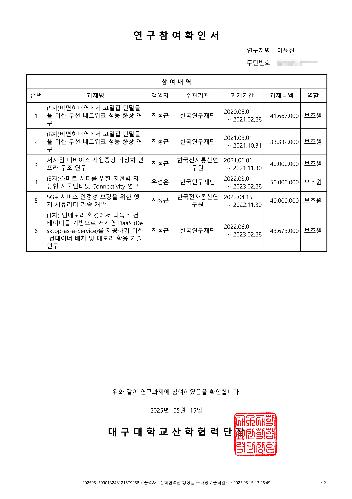
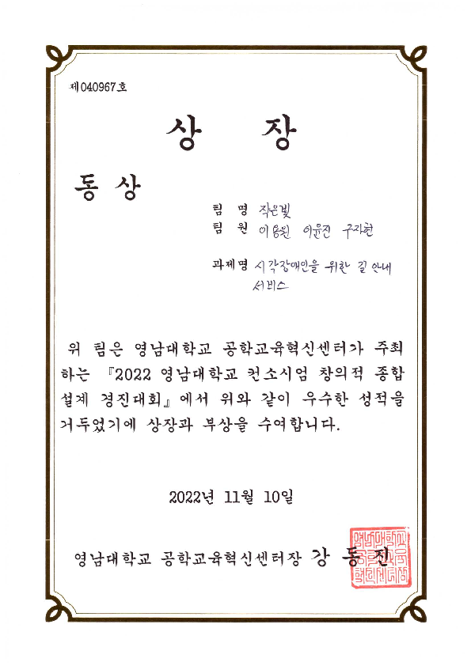
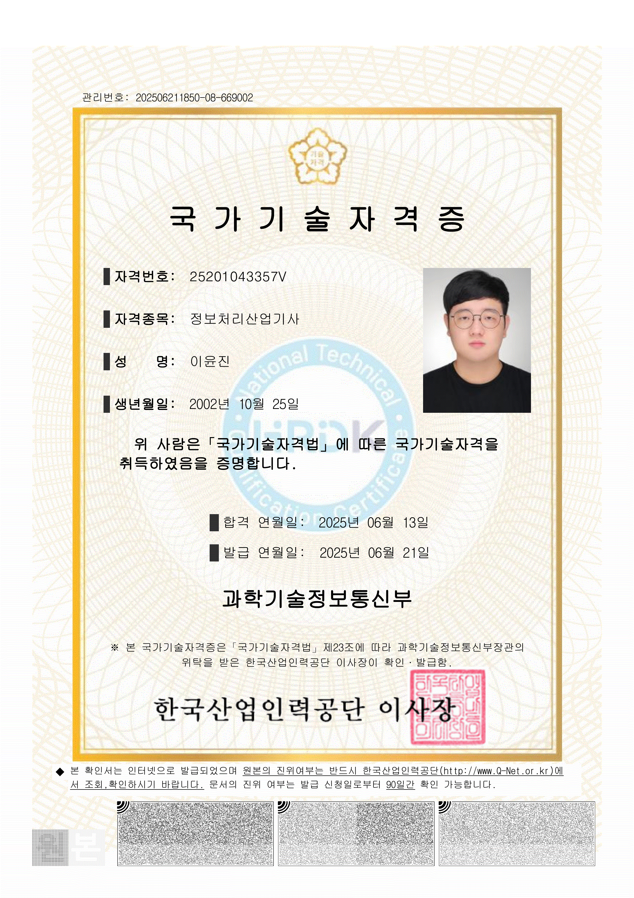

# Hi, I'm @yoonjin67 (Lee Yunjin)

[](https://solved.ac/yoonjin67)
[](https://github.com/anuraghazra/github-readme-stats)

## About Me

I'm a college student with strong interests in Unix/Linux system management, automation scripting, container orchestration, and Go-based development.  
Currently learning Java and C# to expand my backend capabilities.

---

## 🧩 Key Projects

### 🔧 `linuxVirtualization`
A comprehensive Linux container manager using KivyMD for GUI, Go-based server daemon, and shell/Python automation for container lifecycle and permission management.  
AES encryption and bcrypt hashing ensure secure communication.  
The project includes a GUI that interacts with Incus containers and supports various container operations.

**Core Features:**
- **GUI Management** with KivyMD (`MainScreen`, `ManageScreen`, etc.)
- **Secure Server Daemon** in Go (HTTPS, AES, bcrypt)
- **Shell-based system hooks**: `kill.sh`, `server_reload.sh`, `make_base_images.sh` etc.
- **Container Functions**: Create, import, start/stop, delete, and monitor containers

**Lines of Code (cloc summary):**
```
Go: 1185 LOC  
Python: 343 LOC  
Shell: 337 LOC  
Total: 2271 LOC (excluding markdown and comments)
```

---

### 🚘 `RemoteCarFromMonet`
A Kubernetes-integrated system to remotely control a physical car using simulated feedback from a virtual car.  
Developed primarily in C, Go, and Shell. Backend and device control were fully implemented by me, based on lab collaboration.

**Project Structure:**
- Physical car → Sends data  
- Virtual car → Simulates action  
- Result sent back to physical car for execution

**Implemented Components:**
- **Motor Driver (C)** via IOCTL and I2C  
- **Tunneling device driver** as a doubly linked list  
- **K8s deployment structure** and driver pod management (Go + Shell)  
- **Simulation runner and sensor interface**

**Lines of Code (cloc summary):**
```
C: 2730 LOC  
Go: 811 LOC  
Shell: 296 LOC  
Total: 4424 LOC (excluding HTML/JS and removed frontend code)
```


---

## 🧠 Interests

- Unix/Linux System Management
- Container Orchestration (Docker, Incus, Kubernetes, Ansible)
- Go Language (Tcl/Tk 9.0 GUI)
- Shell & Python Automation
- Java, C# (Learning)
## 🧠 Research Assistant Certificates

The award was focused on presentation.
Plus, there can be some problem while uploading collaborated code into this.
So, I attach the actual award.



This needs some comments. I took 'Industrial Engineer' examination 's first screening, as I were not an undergradute student.
And I took a final test in 2025. If I can get enough time to get 'Engineer' examination, which is one step higher than 'Industrial Engineer', I have courage to take.
First screening test's pass rate was 51%. Final test's pass wate was 49.64%, which is quite easier than 2023-2024's test.

---

## 📫 Contact

- Email: [gg582@naver.com](mailto:gg582@naver.com) / [gzblues61@gmail.com](mailto:gzblues61@gmail.com)

---


## 🎧 Personal Note

I enjoy vinyl records and niche experimental music in my spare time.

---

## 🔗 Stats & Profiles

[](https://git.io/streak-stats)  
[](https://github.com/anuraghazra/github-readme-stats)
